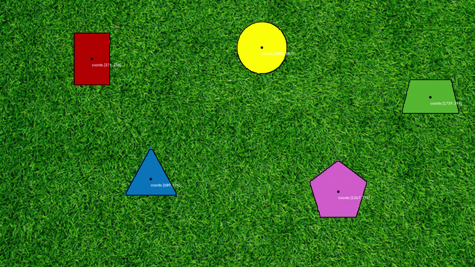
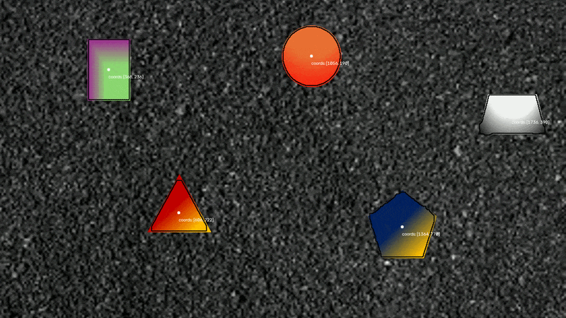
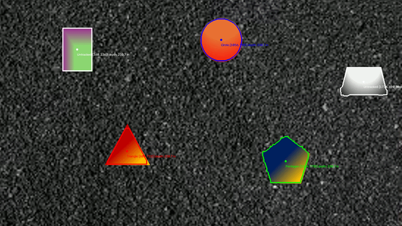

# PennAiR Software Challenge

## Setup for parts 1-4 & 6
Windows:
```bash
python -m venv .venv
.\.venv\Scripts\Activate.ps1
python -m pip install -r requirements.txt
```
Ubuntu (I only added support starting on part 4, to run the earlier parts you might need to get OpenH264):
```bash
python3 -m venv .venv
source .venv/bin/activate
python -m pip install -r requirements.txt
```

Then run `python partX/partX.py` to run part X.

## Results/Explanation
### Part 1
\
To solve this section, I used a filter and threshold to fix each pixel to black or white based on the hsv value channel. The image still had a lot on noise, so I used a morphological open and close to clean up the image, so that there were only the target shapes left. To detect the shapes I used opencv's contour detection.

### Part 2
\
(Whole output video is in [`part2/output_p2.mp4`](part2/output_p2.mp4))\
My approach for this part was pretty simple, as my algorithm was running faster than the time between frames on the video. I just fed each frame to the algorithm, one after another. On my computer, it took 24.37s to process the 61.23s video. I used [OpenH264](https://github.com/cisco/openh264/releases#release-v2.5.0) to generate the avc1/H.264 mp4 video.

### Part 3
\
(Whole output video is in [`part3/output_p3.mp4`](part3/output_p3.mp4))\
My previous algorithm didn't work on this input because of the varying backgrounds of the shapes. I modified my algorithm to threshold by how smooth the image is (The shapes vary much less locally than the noisy background, making them easy to distinguish). I used the directional derivatives (Sobel) of the pixel vale as a proxy for "roughness."\
The algorithm was running slower than real-time, so I made a few modifications:
* I downscaled the image to 1/4 the size
* I removed the morphological close step as the gains in quality were not worth the computational time
* I adjusted the kernel for the morphological open

After these modifications, it took 34.25s to process the 61.37s video frame by frame.

### Part 4
\
(Whole output video is in [`part4/output_p4.mp4`](part4/output_p4.mp4))\
For this part I used the given camera's intrinsic matrix to calculate the depth. As $f_x$ and $f_y$ were roughly equal, I used their average focal length to solve for depth $z = \frac{f_{avg} \cdot R}{r_{px}}$, where $R = 10$ inches is the known circle radius and $r_{px}$ is the radius in pixels. As the problem doesn't specifiy the size of the other shapes, I simplified and assumed all the shapes were the same size.

### Part 5
*Using Ubuntu22.04/ROS 2 Humble*\
For this part, I used a ROS 2 node to stream the background-agnostic input as images. `video_node.py` publishes each image on the `/camera/image` topic:

`detector_node.py` subscribes to `/camera/image`, runs the part 4 algorithm from `detector.py`, and publishes the detection results as a JSON string on `/detections`. To build and run:

```bash
cd ~/ros2_ws && colcon build --packages-select pennair_app && source install/setup.bash
ros2 launch pennair_app part5.launch.py
```
And then to view the output topic in a seperate terminal window:
```bash
ros2 topic echo /detections
```

Giving an output stream formatted as:
```js
data: [
    { //first identified shape
        "x": 196, //x in px
        "y": 598, //y in px
        "depth": 208.45186051070277, //depth in inches
        "outline": [ //outline in px
            [128, 496], 
            [128, 700], 
            [266, 700], 
            [266, 496]
        ]
    }, 
    ...
]
```

### Part 6
\
(Whole output video is in [`part6/output_p6.mp4`](part6/output_p6.mp4))\
In previous parts, my algorithm was time-independent and would not individually differentiate shapes. For this part, I added code to identify and track three different shapes across both time and space:

 - The pentagon is marked in green
 - The triangle is marked in red
 - The circle is marked in blue

I made a scoring algorithm to match contours to each target shape using characteristic properties (like perimeter, area, and previous position). It also displays the path traveled by each shape during the preceding 0.5 seconds. Even if a shape exits and enters the image or gets temporarily covered, the algorithm is able to re-identify it in later frames.

I also added FFMPEG support so it can run on Ubuntu

