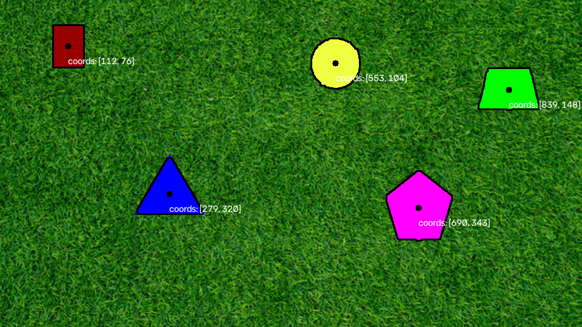

# PennAiR Software Challenge

## Setup
Windows Powershell:
```
python -m venv .venv
.\.venv\Scripts\Activate.ps1
python -m pip install -r requirements.txt
```
Mac/Linux (I didn't test this, and you might need to get [OpenH264](https://github.com/cisco/openh264/releases#release-v2.5.0) to to have the videos render correctly):
```
python3 -m venv .venv
source .venv/bin/activate
python -m pip install -r requirements.txt
```

Then run `python partX/partX.py` to run part X.

## Results/Explanation
### Part 1

To solve this section, I used a filter and threshold to fix each pixel to black or white based on the hsv value channel. The image still had a lot on noise, so I used a morphological open and close to clean up the image, so that there were only the target shapes left. To detect the shapes I used opencv's contour detection.

### Part 2
<video src="cut_videos/output_p2.mp4" width="320" height="240" controls></video>\
(Only first 5s displayed to keep embed size down, the whole output video is in `part2/output_p2.mp4`)\
My approach for this part was pretty simple, as my algorithm was running faster than the time between frames on the video. I just fed each frame to the algorithm, one after another. On my computer, it took 24.37s to process the 61.23s video. I used [OpenH264](https://github.com/cisco/openh264/releases#release-v2.5.0) to generate the avc1/H.264 mp4 video.

### Part 3
<video src="cut_videos/output_p3.mp4" width="320" height="240" controls></video>\
(Only first 5s displayed to keep embed size down, the whole output video is in `part3/output_p3.mp4`)\
My previous algorithm didn't work on this input because of the varying backgrounds of the shapes. I modified my algorithm to threshold by how smooth the image is (The shapes vary much less locally than the noisy background, making them easy to distinguish). I used the directional derivatives of the HSV value as a proxy for "roughness."\
The algorithm was running slower than real-time, so I made a few modifications:
* I downscaled the image to 1/4 the size
* I removed the morphological close step as the gains in quality were not worth the computational time
* I adjusted the kernel for the morphological open
After these modifications it took 34.25s to process the 61.37s video frame by frame.

### Part 4
<video src="cut_videos/output_p4.mp4" width="320" height="240" controls></video>\
For this part I used the given camera's intrinsic matrix to calculate the depth. As $f_x$ and $f_y$ were roughly equal, I used their average focal length to solve for depth $z = \frac{f_{avg} \cdot R}{r_{px}}$, where $R = 10$ inches is the known circle radius and $r_{px}$ is the radius in pixels. As the problem doesn't specifiy the size of the other shapes, I simplified and assumed all the shapes were the same size.
